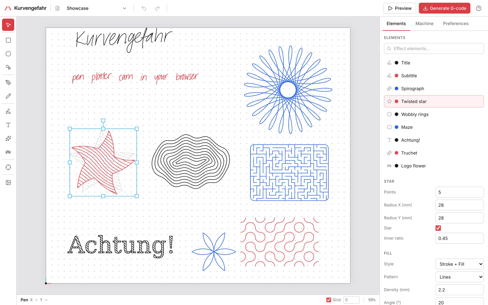

# Kurvengefahr

*"Achtung, die Kurve!"*

A browser-based CAM tool for pen plotters. Compose on a virtual bed - handwriting, text, vector
shapes, imported SVG and DXF, traced photos, generative patterns, STL wireframes - preview the
exact toolpath, and plot it: download G-code, or drive an AxiDraw or GRBL plotter live over USB.
Everything runs client-side; nothing is uploaded.

**[Live app](https://kurvengefahr.org)** - installable PWA, works offline.
[Machine profiles](docs/machines.md) cover Prusa printers with a pen attachment (or any G-code
machine), AxiDraw-style EBB plotters, and GRBL machines, with presets for popular models.



## Features

- **Handwriting** - a recurrent neural network (Graves' handwriting model) writes your text as real
  handwriting, not a font; consistent across words, reproducible per seed and neatness.
- **Text** - single-stroke engraving fonts, plus outline fonts you can fill with any hatch. Real
  typesetting: honest font metrics, kerning, word wrap, and justification.
- **Shapes and paths** - rectangles, ellipses, polygons, stars, Béziers, and freehand, with full
  node editing on the canvas; booleans, join, and weld turn several shapes into one editable path.
- **Flood fill** - click any enclosed region and every visible stroke acts as its boundary: the
  area becomes a regular hatch-filled path (holes included) you can edit like any other shape.
- **Groups, clips, and effects** - nest elements into containers, clip anything to a shape, and
  stack non-destructive distortions (roughen, smooth, wave, sketch, twist, bulge, taper, offset,
  hull) on any of it. The source stays editable throughout.
- **Generative patterns** - spirographs, L-system fractals, Truchet tiles, Voronoi diagrams, and
  flow fields, reproducible per seed.
- **Logo programs** - write turtle graphics in a real Logo (procedures, recursion, lists, seeded
  randomness) in an editor with live diagnostics and autocomplete; `param` declarations become
  inspector knobs, `setpen`/`setpressure` drive color and line weight from code, and programs save
  as reusable tools in the sidebar, importable and exportable. There is a
  [tutorial](docs/logo-tutorial.md) and a [full language reference](docs/logo-reference.md).
- **SVG and DXF import** - files become native, editable paths at real-world size, colors mapped to
  pens; occluded fill regions are clipped away so they don't plot.
- **Raster tracing** - restyle a photo as strokes: outlines, centerlines, topographic levels,
  hatching, scanlines, a single TSP tour, flow fields, or spirals, with live preview.
- **3D models** - import an STL, orbit it in an interactive preview, and it renders as a
  plottable wireframe of the model's feature edges: silhouettes, creases at a tunable angle, and
  boundaries, with hidden lines removed or kept and a perspective or orthographic camera.
- **Hatch fills** - a pen can't lay solid ink, so closed shapes fill with lines, rings, one-line
  Fermat spirals, Hilbert curves, mazes, and friends, at an adjustable density.
- **Made for pens** - a pen per element with color-grouped output and swap pauses, pressure as line
  weight (mapped to Z on spring-loaded holders), dashed strokes, travel-optimized ordering, a
  registration pause to line up the paper, and a scrubbable preview of the exact toolpath.
- **Plot it** - download G-code, send it to a PrusaLink printer with the companion Bridge
  extension, or plot live over Web Serial with pause/resume and a moving playhead - AxiDraw-style
  machines and GRBL 1.1 plotters (Z-axis or servo pen, optional homing) alike. Artwork also
  exports as SVG, PNG, or PDF, and prints at true physical scale for a paper proof.
- **A real editor** - autosaved multi-document tabs with cross-tab sync, undo/redo that survives a
  refresh, an elements tree, a command palette, clipboard across tabs, light/dark themes.
- **Share a link** - turn a document into a link that opens a read-only view of that snapshot,
  with an "Edit a copy" action to keep editing. The document is encrypted in your browser before
  upload; the key rides in the link itself and never reaches the server. Self-hosters can run
  their own [share service](share-api/) or simply build without one.

The [docs](docs/) are the full manual: [the editor](docs/editor.md),
[every element type](docs/elements.md), [effects](docs/effects.md),
[plotting and export](docs/plotting.md), [sharing](docs/sharing.md),
[machine profiles](docs/machines.md), the Logo [tutorial](docs/logo-tutorial.md) and
[reference](docs/logo-reference.md), plus the [`.kgz` file format](docs/file-format.md) and the
[browser API](docs/browser-api.md) for userscripts and headless tooling.

## How it works

Every mark - handwriting, a shape, an imported path, a traced image - reduces to the same thing: a
list of pen-down polylines in millimeters. That representation flows through one pipeline (place on
the page, clip to the reachable area, optimize stroke order, then emit G-code or plan machine
motion), so adding a new input type never touches the machinery downstream.

The app is client-only React, but all the geometry - the handwriting model, font and text layout,
shape and path math, polygon booleans, SVG and DXF parsing, occlusion, image tracing, generative
patterns, the Logo interpreter, clipping, and path optimization - is Rust compiled to WebAssembly
(the `kg_core` crate). The handwriting model, image tracing, and Logo programs run in Web Workers
so the UI stays responsive.

## Building

```bash
npm install
npm run dev        # builds the wasm crate, then starts Vite
npm run build      # wasm + tsc + vite build
```

Requires the Rust `wasm32-unknown-unknown` target and `wasm-pack`. After changing `crate/`, rebuild
with `npm run build:wasm`. The Rust crate has tests (`cargo test`), including a NumPy reference that
validates the handwriting model.

Sharing is optional: set `VITE_SHARE_API_URL` at build time to the base URL of a
[share service](share-api/) instance to enable it; leave it unset and the app builds with no
share UI at all. For local development, `docker compose -f share-api/dev/compose.yml up --build`
runs a Garage-backed share service that `npm run dev` targets automatically (via
`.env.development`).

CI runs on every push to `main`; publishing to GitHub Pages at kurvengefahr.org is a manual
workflow run.

## Contributing and license

Bug reports and feature requests are the most valued contribution; code is welcome too - see
[CONTRIBUTING.md](CONTRIBUTING.md). Licensed under the [GNU GPL v2.0](LICENSE) (GPL-2.0-only).
