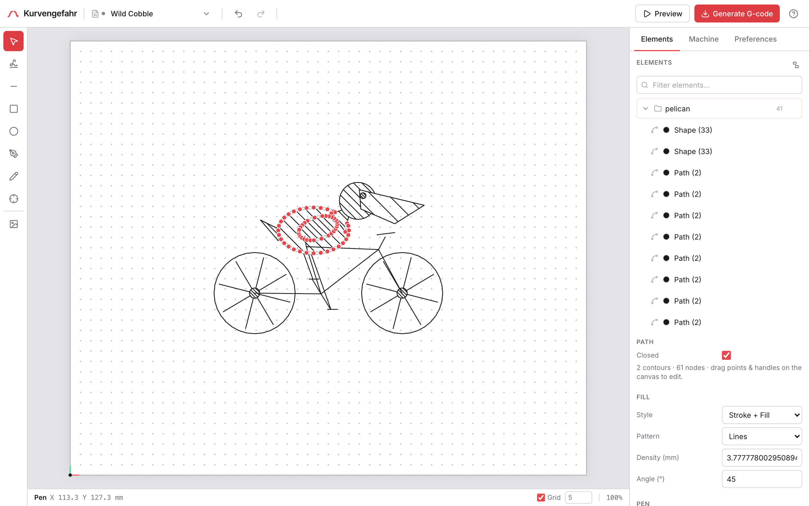
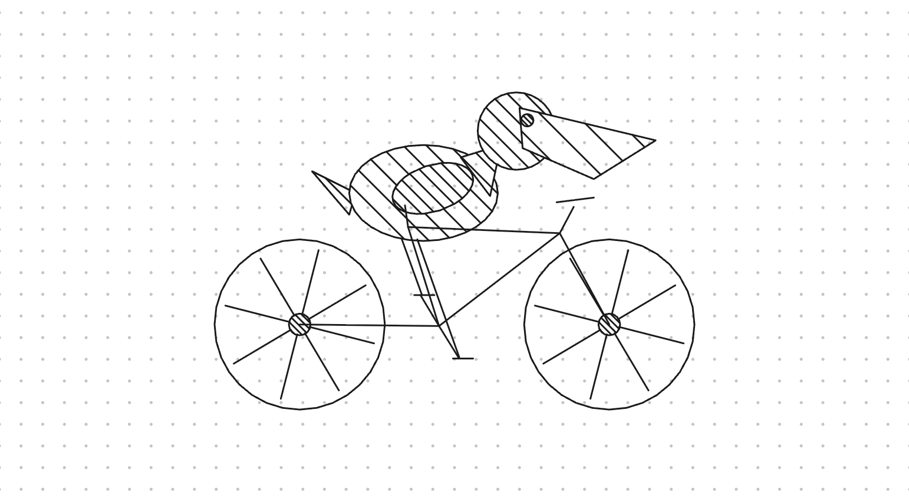

# Kurvengefahr

A browser-based CAM tool for pen plotters. Compose on a virtual bed -- handwriting, text, vector
shapes, imported SVG and DXF, traced photos, generative patterns -- preview the exact toolpath, and
download G-code. Everything runs client-side; nothing is uploaded.

**[Live app](https://kurven.ojdip.net)** -- installable PWA, works offline. Built for a Prusa MK4
with a spring-loaded pen holder; the machine profile is editable.



## Features

- **Handwriting** -- Type text and a recurrent neural network (Graves' handwriting model) renders it
  as real handwriting, not a font. Consistent across words and reproducible per text/seed/bias.
- **Text** -- Single-line (engraving) fonts that plot as one stroke per letter, plus outline fonts you
  can fill with any hatch. One element type covers both.
- **Shapes and paths** -- Rectangles, ellipses, lines, Bézier paths, and freehand. Edit points and
  curve handles on the canvas: add/delete nodes, rubber-band and multi-select, drag several at once,
  toggle corner/smooth, break handle symmetry.
- **Booleans, join & weld** -- Union, subtract, intersect, and exclude on closed shapes (holes
  included); combine several elements into one editable compound path (Bézier curves preserved); weld
  touching open contours into a single fillable outline; or break a compound path back into its
  pieces.
- **Clip to shape** -- Clip anything (generative patterns, traced images, handwriting, imports) to a
  shape, non-destructively: the topmost selection becomes the mask, the rest is clipped to it. Clips
  nest and transform as one object, the mask stays editable and comes back when you release the clip,
  and you can flatten a clip into plain paths with convert-to-path.
- **Generative** -- Parametric pattern generators: spirographs, L-system fractals, Truchet tiles,
  Voronoi diagrams, and noise flow fields, each fit to a box and reproducible per seed.
- **Vector import** -- SVG and DXF become native, editable paths, sized to fit or imported at 1:1
  (real size for physical units, or a chosen DPI for pixel art). For SVG, overlapping fills are
  clipped to their visible area so hidden regions don't plot, colors map to the nearest pen, and fill
  darkness sets hatch density. DXF imports lines, polylines (with bulges), arcs, circles, ellipses,
  and splines as line art at real-world size (units read from the header, overridable), colored by
  entity or layer, merging connected segments into polylines so a drawing exported as thousands of
  loose lines becomes a handful of paths.
- **Raster tracing** -- Restyle an image as strokes: contour outlines, centerlines for line art (one
  stroke per line), topographic levels, hatching, scanlines, a single TSP tour, flow fields, or
  spirals, with live preview.
- **Hatch fills** -- A pen can't lay solid ink, so closed shapes fill with lines, cross-hatch, grid,
  concentric rings, a Hilbert curve, a gradient, scribble, stipple dots, Voronoi cells, or Truchet
  tiles at an adjustable density.
- **Stroke styles** -- Dashed strokes per element, broken into real on/off marks by arc length, shown
  in the preview and the G-code.
- **Multi-pen output** -- Assign a pen per element; the job is grouped by color with a pause to swap
  pens between colors, and each color's strokes are ordered to cut pen travel.
- **Pen pressure** -- Set a pressure per element, shown as line weight on the canvas and in the
  preview. The machine profile maps it to a pen-down Z range (light to full) for a spring-loaded
  holder; profiles that only do pen up/down can turn pressure off, which disables the control.
- **Reachable area** -- Account for the pen's offset from the nozzle; anything the pen can't reach is
  greyed out and clipped away.
- **Registration** -- An optional fiducial point the plot travels to and pauses at, so you can
  position the paper before the first stroke.
- **Preview** -- Scrub and play back the whole toolpath -- travel moves, pen lifts, and draws --
  before downloading the G-code.
- **Export** -- Download G-code, or export the artwork as SVG or a transparent PNG.
- **Plot directly** -- With the companion PrusaLink Bridge browser extension, bind a profile to one of
  your printers and send the job straight to it with one click -- no download-and-transfer. Credentials
  live in the extension; the app only ever sees the printer's name and live status.
- **Elements tree** -- A searchable, collapsible list of every element with named groups; selection
  is synced both ways with the canvas.
- **Documents** -- Multiple drawings in tabs, autosaved, with cross-tab sync, undo/redo that survives
  a refresh, and `.kgz` export.
- A command palette (`Ctrl/Cmd+K`), fit-to-view, system-clipboard copy/paste across documents and
  tabs (and image paste), light/dark themes, grid snapping, and a responsive layout that collapses to
  a drawer on small screens.



## How it works

Every mark -- handwriting, a shape, an imported path, a traced image -- reduces to the same thing: a
list of pen-down polylines in millimetres. That representation flows through one pipeline (place on
the page, clip to the reachable area, optimize stroke order, emit G-code), so adding a new input type
never touches the machinery downstream.

The app is client-only React, but all the geometry -- the handwriting model, font and text layout,
shape and path math, polygon booleans, SVG and DXF parsing, occlusion, image tracing, generative
patterns, clipping, and path optimization -- is Rust compiled to WebAssembly (the `kg_core` crate). The
handwriting model and image tracing run in Web Workers so the UI stays responsive.

## Building

```bash
npm install
npm run dev        # builds the wasm crate, then starts Vite
npm run build      # wasm + tsc + vite build
```

Requires the Rust `wasm32-unknown-unknown` target and `wasm-pack`. After changing `crate/`, rebuild
with `npm run build:wasm`. The Rust crate has tests (`cargo test`), including a NumPy reference that
validates the handwriting model.

Push to `main` and GitHub Actions deploys to GitHub Pages at kurven.ojdip.net.
